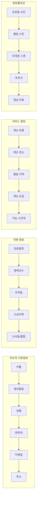
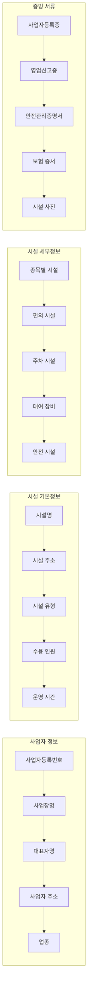

# 모두의 핏 - 상세 플로우 다이어그램 (이미지 스타일)

## 전체 통합 플로우 (복합 다이어그램)

```mermaid
flowchart TD
    %% 최상단 - 앱 진입
    AppStart[앱 시작] --> Auth{인증 상태}
    Auth -->|로그인됨| MainTabs[메인 탭바]
    Auth -->|비로그인| LoginMain[로그인 메인]
    
    %% 로그인/회원가입 분기
    LoginMain --> ExistingLogin[기존 회원 로그인]
    LoginMain --> NewSignup[신규 회원가입]
    
    %% 로그인 프로세스
    ExistingLogin --> EmailLogin[이메일 로그인]
    ExistingLogin --> PhoneLogin[전화번호 로그인]
    ExistingLogin --> SocialLogin[소셜 로그인]
    EmailLogin --> PasswordInput[비밀번호 입력]
    PhoneLogin --> PasswordInput
    SocialLogin --> SocialAuth[소셜 인증]
    PasswordInput --> LoginValidation{로그인 검증}
    SocialAuth --> LoginValidation
    LoginValidation -->|성공| MainTabs
    LoginValidation -->|실패| LoginError[로그인 실패]
    LoginError --> ExistingLogin
    
    %% 회원가입 타입 선택
    NewSignup --> UserTypeChoice[사용자 타입 선택]
    UserTypeChoice --> GeneralSignup[일반 사용자]
    UserTypeChoice --> TrainerSignup[지도자 신청]
    UserTypeChoice --> OperatorSignup[시설 운영자 신청]
    
    %% === 일반 사용자 회원가입 플로우 ===
    GeneralSignup --> GenBasicInfo[기본정보 입력]
    GenBasicInfo --> GenInterests[관심종목 선택]
    GenInterests --> GenLocation[활동지역 설정]
    GenLocation --> GenTerms[약관동의]
    GenTerms --> GenComplete[가입완료]
    GenComplete --> WelcomeScreen[환영메시지]
    WelcomeScreen --> MainTabs
    
    %% === 지도자 회원가입 플로우 ===
    TrainerSignup --> TrainerBasicInfo[지도자 기본정보]
    TrainerBasicInfo --> TrainerProfile[프로필 작성]
    TrainerProfile --> TrainerSports[전문종목 선택]
    TrainerSports --> TrainerCareer[경력사항 입력]
    TrainerCareer --> TrainerCertUpload[자격증 업로드]
    TrainerCertUpload --> TrainerPortfolio[포트폴리오 업로드]
    TrainerPortfolio --> TrainerIntroduction[소개글 작성]
    TrainerIntroduction --> TrainerService[서비스 정보]
    TrainerService --> TrainerArea[활동지역 설정]
    TrainerArea --> TrainerPrice[레슨 요금 설정]
    TrainerPrice --> TrainerSchedule[가능시간 설정]
    TrainerSchedule --> TrainerTerms[약관동의]
    TrainerTerms --> TrainerSubmit[신청서 제출]
    TrainerSubmit --> TrainerWaiting[검토 대기]
    
    %% === 시설 운영자 회원가입 플로우 ===
    OperatorSignup --> OperatorBasicInfo[운영자 기본정보]
    OperatorBasicInfo --> BusinessInfo[사업자정보 입력]
    BusinessInfo --> FacilityBasicInfo[시설 기본정보]
    FacilityBasicInfo --> FacilityLocation[시설 위치 설정]
    FacilityLocation --> FacilityType[시설 유형 선택]
    FacilityType --> FacilityHours[운영시간 설정]
    FacilityHours --> FacilityPhotos[시설 사진 업로드]
    FacilityPhotos --> BusinessDocuments[사업자등록증 업로드]
    BusinessDocuments --> AdditionalDocs[추가 증빙서류]
    AdditionalDocs --> FacilityAmenities[편의시설 정보]
    FacilityAmenities --> OperatorTerms[약관동의]
    OperatorTerms --> OperatorSubmit[신청서 제출]
    OperatorSubmit --> OperatorWaiting[검토 대기]
    
    %% === 관리자 검토 프로세스 ===
    TrainerWaiting --> AdminQueue1[관리자 검토 큐]
    OperatorWaiting --> AdminQueue2[관리자 검토 큐]
    
    AdminQueue1 --> TrainerReview[지도자 신청 검토]
    AdminQueue2 --> OperatorReview[운영자 신청 검토]
    
    TrainerReview --> TrainerDocCheck[서류 검증]
    TrainerDocCheck --> TrainerBackgroundCheck[신원 확인]
    TrainerBackgroundCheck --> TrainerQualification[자격 요건 확인]
    TrainerQualification --> TrainerDecision{최종 승인 여부}
    
    OperatorReview --> OperatorDocCheck[서류 검증]
    OperatorDocCheck --> BusinessVerification[사업자 확인]
    BusinessVerification --> FacilityInspection{현장 확인 필요?}
    FacilityInspection -->|필요| OnSiteInspection[현장 확인]
    FacilityInspection -->|불필요| OperatorDecision{최종 승인 여부}
    OnSiteInspection --> InspectionResult{현장 확인 결과}
    InspectionResult -->|적합| OperatorDecision
    InspectionResult -->|부적합| FacilityImprovement[시설 개선 요청]
    
    %% === 승인/반려 처리 ===
    TrainerDecision -->|승인| TrainerApproved[지도자 승인]
    TrainerDecision -->|조건부 승인| TrainerConditional[조건부 승인]
    TrainerDecision -->|반려| TrainerRejected[지도자 반려]
    
    OperatorDecision -->|승인| OperatorApproved[운영자 승인]
    OperatorDecision -->|조건부 승인| OperatorConditional[조건부 승인]
    OperatorDecision -->|반려| OperatorRejected[운영자 반려]
    
    %% === 승인 후 프로세스 ===
    TrainerApproved --> TrainerActivation[지도자 계정 활성화]
    TrainerConditional --> TrainerConditionCheck[조건 이행 확인]
    TrainerConditionCheck --> TrainerActivation
    TrainerActivation --> TrainerDashboard[지도자 대시보드]
    TrainerDashboard --> TrainerFeatures[지도자 기능 활성화]
    
    OperatorApproved --> OperatorActivation[운영자 계정 활성화]
    OperatorConditional --> OperatorConditionCheck[조건 이행 확인]
    OperatorConditionCheck --> OperatorActivation
    OperatorActivation --> FacilityRegistration[시설 등록 완료]
    FacilityRegistration --> OperatorDashboard[운영자 대시보드]
    OperatorDashboard --> OperatorFeatures[시설 관리 기능]
    
    %% === 반려 처리 ===
    TrainerRejected --> TrainerRejectionNotice[반려 사유 안내]
    TrainerRejectionNotice --> TrainerReapply{재신청 여부}
    TrainerReapply -->|예| TrainerBasicInfo
    TrainerReapply -->|아니오| MainTabs
    
    OperatorRejected --> OperatorRejectionNotice[반려 사유 안내]
    OperatorRejectionNotice --> OperatorReapply{재신청 여부}
    OperatorReapply -->|예| OperatorBasicInfo
    OperatorReapply -->|아니오| MainTabs
    
    FacilityImprovement --> ImprovementComplete[개선 완료]
    ImprovementComplete --> OnSiteInspection
    
    %% === 메인 앱 기능 연결 ===
    MainTabs --> HomeTab[홈 탭]
    MainTabs --> FacilityTab[운동시설 탭]
    MainTabs --> CommunityTab[커뮤니티 탭]
    MainTabs --> MyPageTab[마이페이지 탭]
    
    %% 홈 탭 기능
    HomeTab --> LocationSearch[위치 기반 검색]
    HomeTab --> TrainerMatching[지도자 매칭]
    HomeTab --> QuickReservation[빠른 예약]
    
    %% 지도자 매칭 세부 플로우
    TrainerMatching --> MatchingPreferences[매칭 선호도 설정]
    MatchingPreferences --> AIMatching[AI 매칭 시작]
    AIMatching --> MatchingResults[매칭 결과]
    MatchingResults --> TrainerDetail[지도자 상세]
    TrainerDetail --> MatchingRequest[매칭 신청]
    MatchingRequest --> MatchingConfirmation[매칭 확정]
    
    %% 시설 관련 플로우
    FacilityTab --> FacilitySearch[시설 검색]
    FacilitySearch --> FacilityList[시설 목록]
    FacilityList --> FacilityDetail[시설 상세]
    FacilityDetail --> ReservationCalendar[예약 캘린더]
    ReservationCalendar --> TimeSlotSelection[시간대 선택]
    TimeSlotSelection --> PaymentProcess[결제 진행]
    PaymentProcess --> ReservationComplete[예약 완료]
    
    %% 커뮤니티 기능
    CommunityTab --> CommunityList[커뮤니티 목록]
    CommunityList --> CommunityDetail[커뮤니티 상세]
    CommunityDetail --> CommunityJoin[커뮤니티 가입]
    CommunityDetail --> ChatRoom[채팅방]
    CommunityDetail --> EventSchedule[모임 일정]
    
    %% 마이페이지 기능
    MyPageTab --> ProfileManagement[프로필 관리]
    MyPageTab --> ReservationHistory[예약 내역]
    MyPageTab --> FavoritesList[찜 목록]
    MyPageTab --> CustomerSupport[고객지원]
    
    %% === 알림 시스템 ===
    TrainerSubmit --> NotificationTrainer1[지도자 신청 알림]
    OperatorSubmit --> NotificationOperator1[운영자 신청 알림]
    TrainerApproved --> NotificationTrainer2[지도자 승인 알림]
    OperatorApproved --> NotificationOperator2[운영자 승인 알림]
    MatchingConfirmation --> NotificationMatching[매칭 확정 알림]
    ReservationComplete --> NotificationReservation[예약 완료 알림]
    
    %% === 스타일 정의 ===
    classDef startEnd fill:#e8f5e8,stroke:#2e7d32,stroke-width:3px
    classDef userInput fill:#e3f2fd,stroke:#1976d2,stroke-width:2px
    classDef process fill:#f3e5f5,stroke:#7b1fa2,stroke-width:2px
    classDef decision fill:#fff3e0,stroke:#f57c00,stroke-width:2px
    classDef approval fill:#e8f5e8,stroke:#388e3c,stroke-width:2px
    classDef rejection fill:#ffebee,stroke:#d32f2f,stroke-width:2px
    classDef waiting fill:#fff8e1,stroke:#fbc02d,stroke-width:2px
    classDef notification fill:#fce4ec,stroke:#c2185b,stroke-width:2px
    classDef mainFeature fill:#e0f2f1,stroke:#00796b,stroke-width:2px
    
    %% 클래스 적용
    class AppStart,MainTabs startEnd
    class GenBasicInfo,TrainerBasicInfo,OperatorBasicInfo,EmailLogin,PhoneLogin userInput
    class TrainerProfile,OperatorReview,BusinessVerification,AIMatching process
    class Auth,LoginValidation,TrainerDecision,OperatorDecision,FacilityInspection decision
    class TrainerApproved,OperatorApproved,GenComplete,ReservationComplete approval
    class TrainerRejected,OperatorRejected,LoginError rejection
    class TrainerWaiting,OperatorWaiting,AdminQueue1,AdminQueue2 waiting
    class NotificationTrainer1,NotificationOperator1,NotificationTrainer2,NotificationOperator2 notification
    class HomeTab,FacilityTab,CommunityTab,MyPageTab,TrainerMatching,FacilitySearch mainFeature
```

## 화면별 상세 입력 폼

### 지도자 회원가입 상세 화면

```mermaid
flowchart LR
    subgraph "지도자 기본정보"
        T1[이름] --> T2[생년월일]
        T2 --> T3[성별]
        T3 --> T4[연락처]
        T4 --> T5[이메일]
        T5 --> T6[주소]
    end
    
    subgraph "전문 정보"
        P1[전문종목] --> P2[경력년수]
        P2 --> P3[자격증]
        P3 --> P4[수상이력]
        P4 --> P5[소속팀/클럽]
    end
    
    subgraph "서비스 정보"
        S1[레슨 유형] --> S2[레슨 장소]
        S2 --> S3[활동 지역]
        S3 --> S4[레슨 요금]
        S4 --> S5[가능 시간대]
    end
    
    subgraph "포트폴리오"
        F1[프로필 사진] --> F2[활동 사진]
        F2 --> F3[자격증 스캔]
        F3 --> F4[추천서]
        F4 --> F5[영상 자료]
    end
```

### 시설 운영자 회원가입 상세 화면

```mermaid
flowchart LR
    subgraph "사업자 정보"
        B1[사업자등록번호] --> B2[사업장명]
        B2 --> B3[대표자명]
        B3 --> B4[사업자 주소]
        B4 --> B5[업종]
    end
    
    subgraph "시설 기본정보"
        F1[시설명] --> F2[시설 주소]
        F2 --> F3[시설 유형]
        F3 --> F4[수용 인원]
        F4 --> F5[운영 시간]
    end
    
    subgraph "시설 세부정보"
        D1[종목별 시설] --> D2[편의 시설]
        D2 --> D3[주차 시설]
        D3 --> D4[대여 장비]
        D4 --> D5[안전 시설]
    end
    
    subgraph "증빙 서류"
        C1[사업자등록증] --> C2[영업신고증]
        C2 --> C3[안전관리증명서]
        C3 --> C4[보험 증서]
        C4 --> C5[시설 사진]
    end
```

이 플로우는 이미지와 같은 복잡하고 상세한 구조로 모두의 핏 앱의 전체 회원가입 및 주요 기능들을 포괄적으로 표현합니다.
