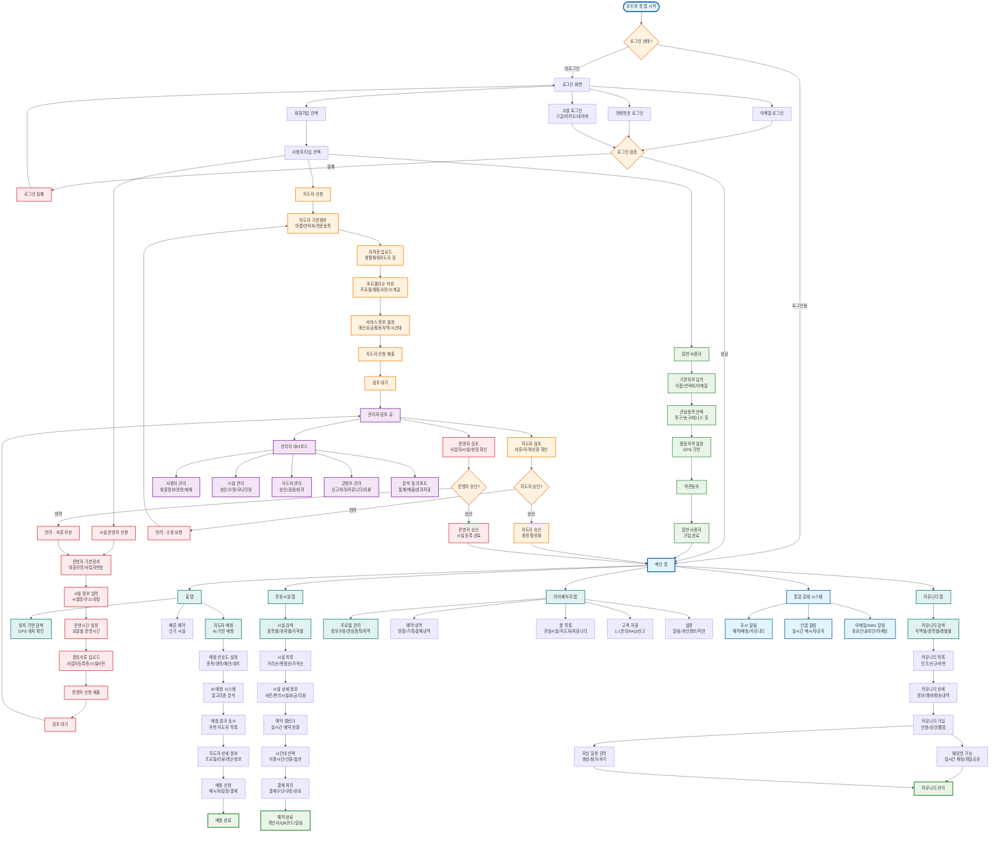
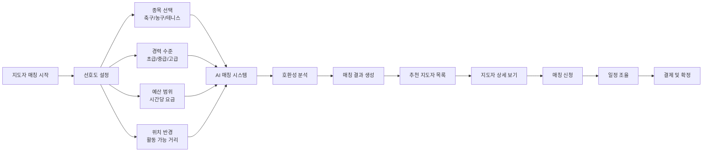
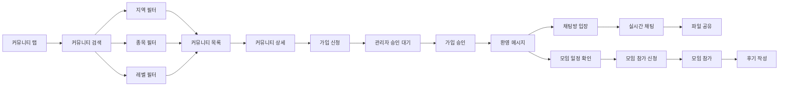
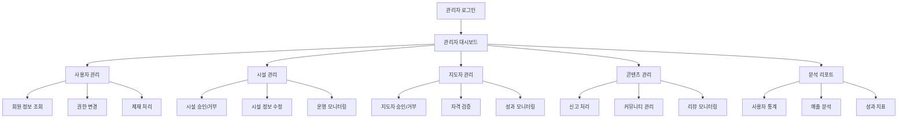

# 모두의 핏 - 전체 프로세스 플로우 (Mermaid)

## 🎯 전체 통합 플로우 다이어그램

## 🎯 주요 기능별 상세 플로우

### 1. 지도자 매칭 시스템

### 2. 시설 예약 시스템

```mermaid
flowchart LR
    A[시설 예약 시작] --> B[시설 검색]
    B --> C[필터 적용<br/>종목/위치/가격]
    C --> D[시설 목록]
    D --> E[시설 상세]
    E --> F[예약 캘린더]
    F --> G[날짜 선택]
    G --> H[시간대 선택]
    H --> I[인원 수 입력]
    I --> J[추가 옵션<br/>장비 대여 등]
    J --> K[결제 수단 선택]
    K --> L[할인 쿠폰 적용]
    L --> M[결제 완료]
    M --> N[예약 확인서]
    N --> O[QR 코드 생성]
    O --> P[알림 설정]
```

### 3. 커뮤니티 가입 및 활동

## 🛠️ 관리자 시스템 플로우

## 📱 사용법

이 mermaid 다이어그램은 다음과 같이 사용할 수 있습니다:

1. **GitHub**: `.md` 파일에 붙여넣으면 자동 렌더링
2. **VS Code**: Mermaid 확장프로그램 설치 후 미리보기
3. **Mermaid Live Editor**: https://mermaid.live/ 에서 바로 확인
4. **Notion, Obsidian** 등: 대부분의 마크다운 에디터에서 지원

모든 모두의 핏 프로세스가 하나의 통합된 플로우로 구성되어 있어서 전체 서비스 구조를 한눈에 파악할 수 있습니다!
