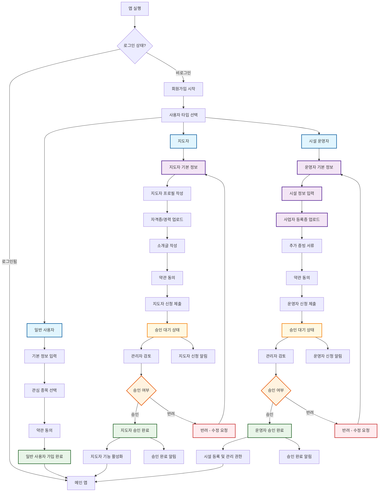
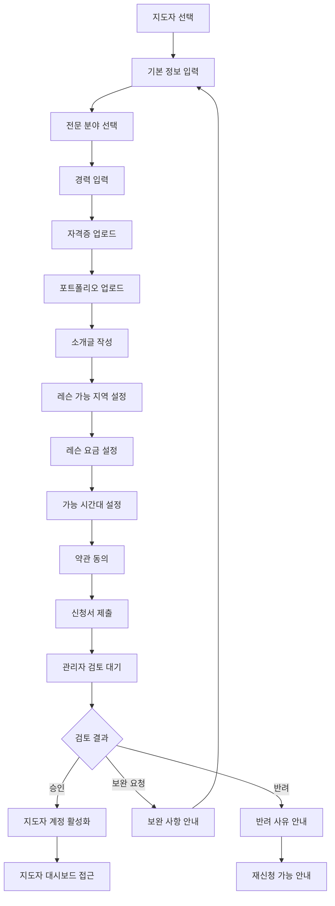
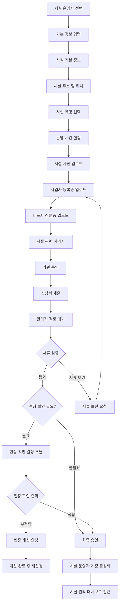
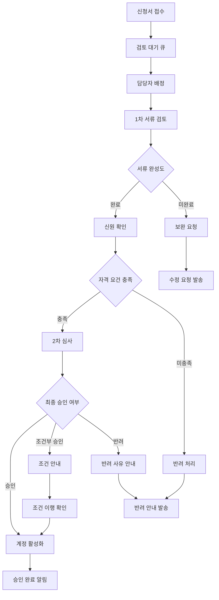
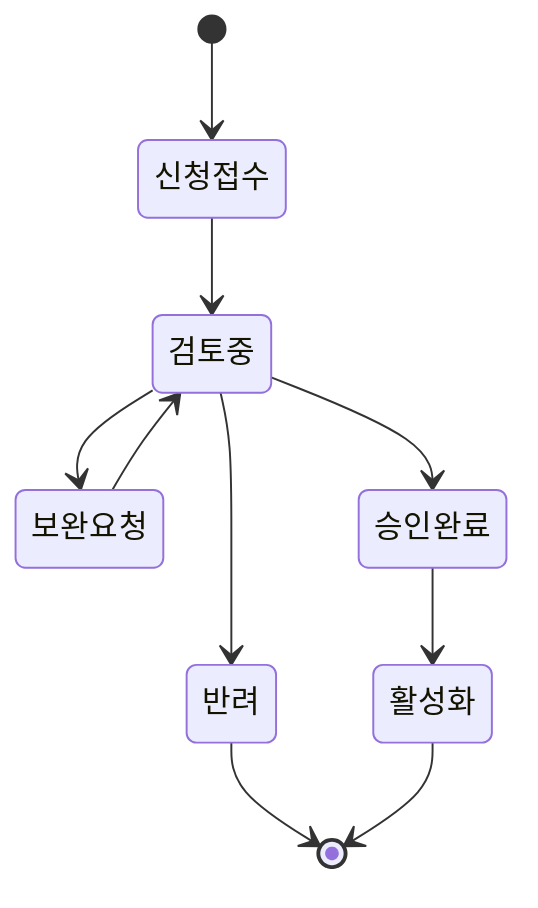

# 모두의 핏 - 통합 회원가입 플로우

## 전체 회원가입 플로우 다이어그램

## 세부 프로세스별 플로우

### 1. 지도자 회원가입 상세 플로우

### 2. 시설 운영자 회원가입 상세 플로우

### 3. 관리자 검토 프로세스

## 화면별 입력 항목

### 지도자 회원가입 필수 항목
- **기본 정보**: 이름, 연락처, 이메일, 주소
- **전문 분야**: 운동 종목, 세부 전문 분야
- **경력 사항**: 경력 년수, 주요 경력, 수상 이력
- **자격증**: 자격증명, 발급기관, 취득일자, 증명서 파일
- **포트폴리오**: 프로필 사진, 활동 사진, 영상
- **서비스 정보**: 레슨 지역, 요금, 가능 시간대
- **소개글**: 자기소개, 레슨 스타일, 특기사항

### 시설 운영자 회원가입 필수 항목
- **기본 정보**: 대표자명, 연락처, 이메일
- **사업자 정보**: 사업자등록번호, 사업장명, 사업자등록증
- **시설 정보**: 시설명, 주소, 좌표, 시설 유형
- **운영 정보**: 운영시간, 휴무일, 연락처
- **시설 현황**: 시설 사진, 편의시설, 장비 현황
- **증빙 서류**: 영업신고증, 안전관리증명서, 보험증서
- **약관 동의**: 운영정책, 수수료 정책, 환불정책

## 상태 관리

이 플로우를 통해 일반 사용자, 지도자, 시설 운영자 모두의 회원가입 프로세스가 체계적으로 관리될 수 있습니다.
