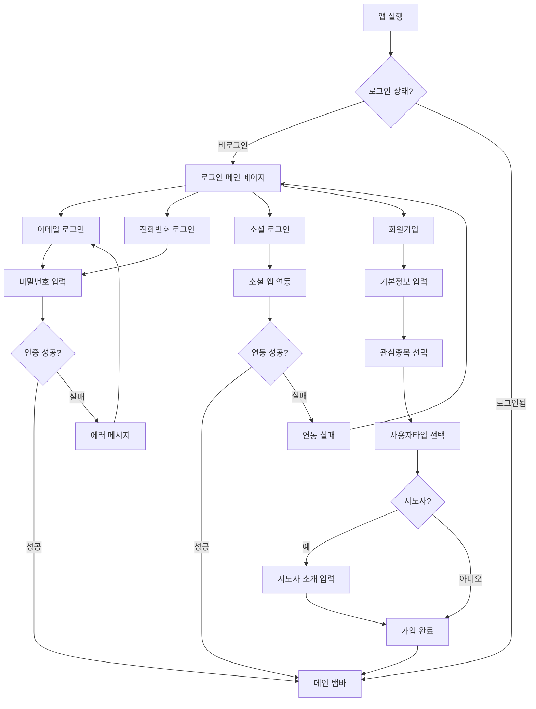
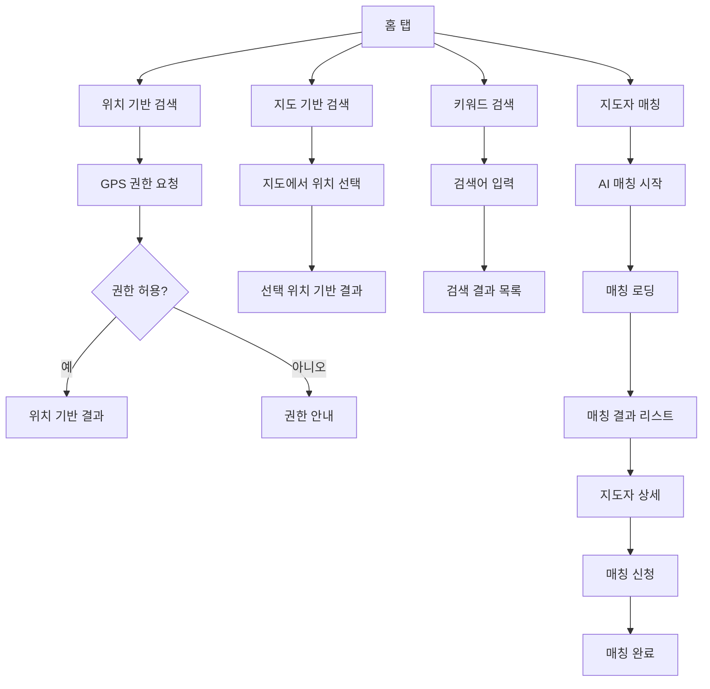
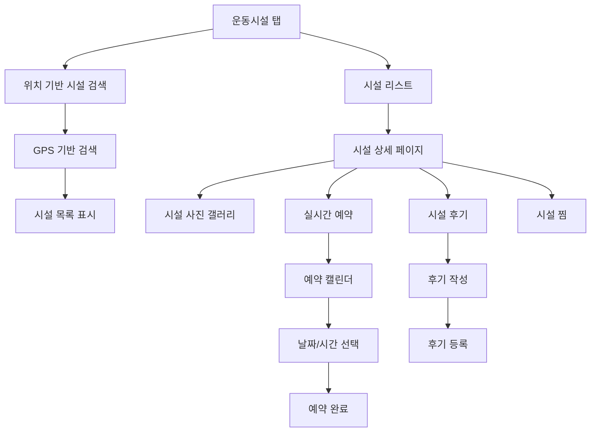
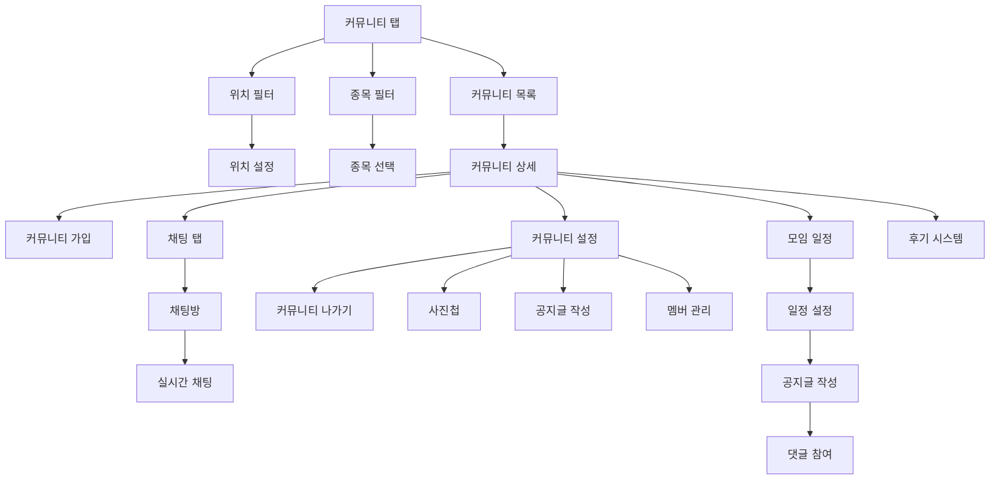
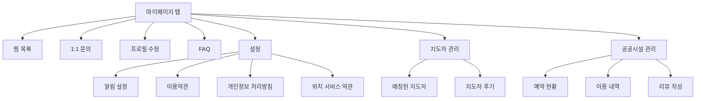
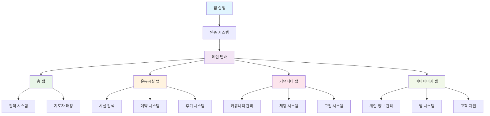
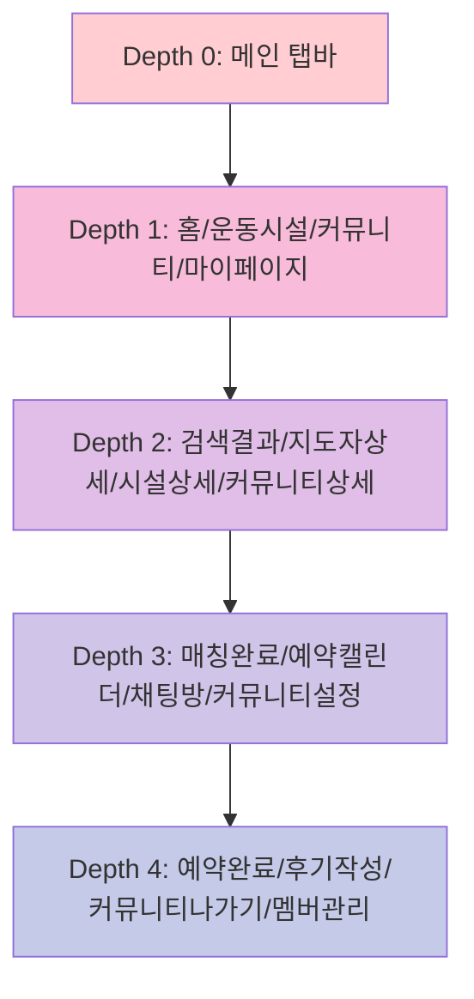
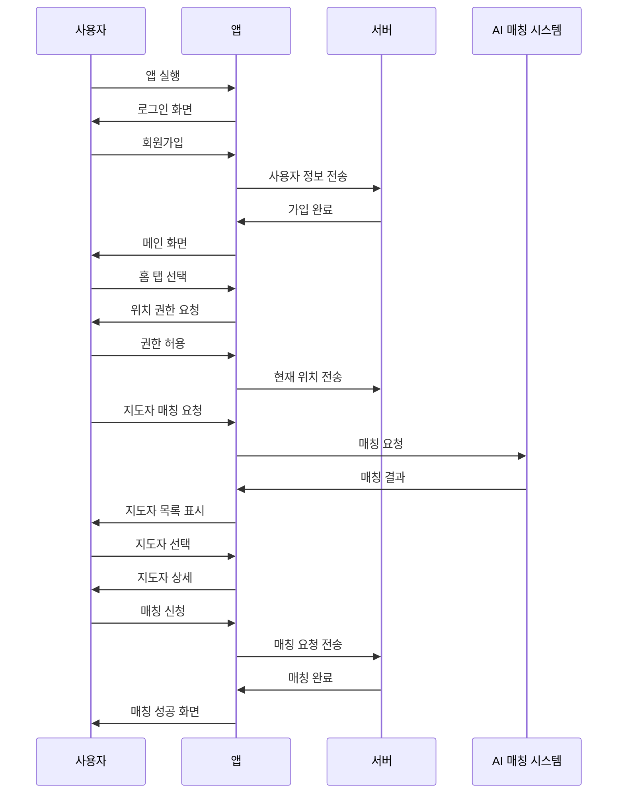
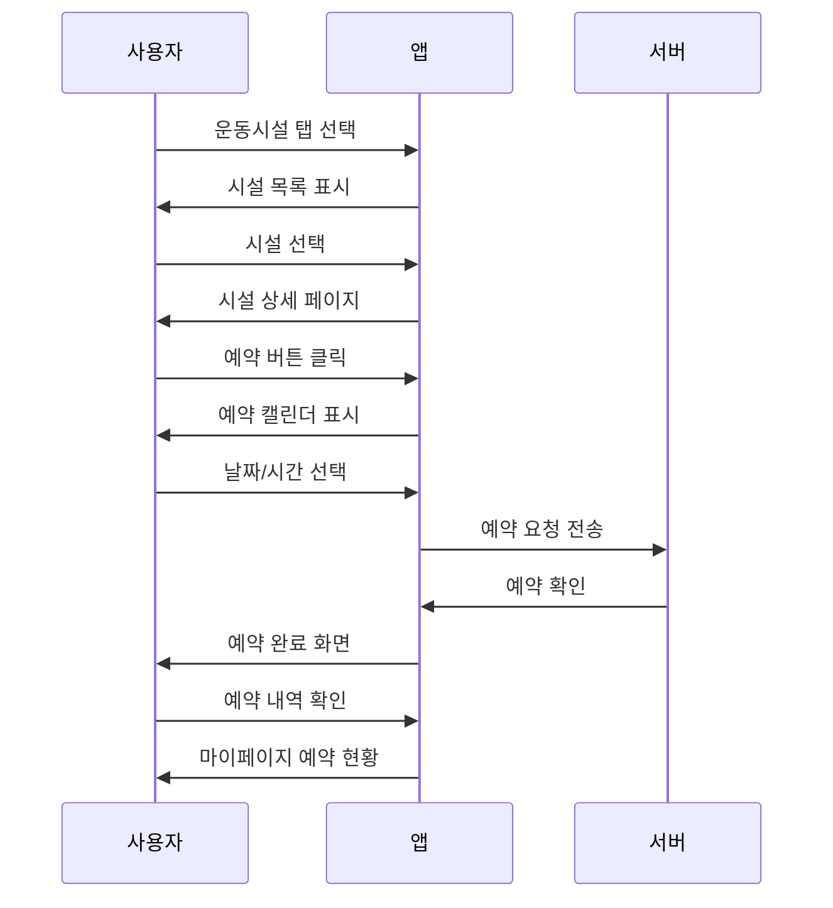

# 모두의 핏 앱 - 사용자 플로우 다이어그램

## 1. 앱 실행 및 인증 플로우

## 2. 홈 탭 플로우

## 3. 운동시설 탭 플로우

## 4. 커뮤니티 탭 플로우

## 5. 마이페이지 탭 플로우

## 6. 전체 앱 네비게이션 구조

## 7. 화면 깊이 구조

## 8. 주요 사용자 시나리오

### 시나리오 1: 새로운 사용자의 지도자 매칭

### 시나리오 2: 운동시설 예약

이 다이어그램들을 통해 개발팀과 디자인팀이 사용자 플로우를 명확히 이해하고 개발할 수 있습니다! 