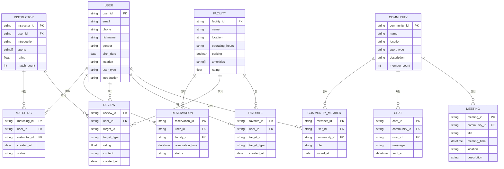

# 모두의 핏 앱 - 정보 아키텍처 맵

## 전체 정보 구조

```
모두의 핏 앱
├── 인증 및 접근
│   ├── 로그인 시스템
│   │   ├── 이메일 로그인
│   │   ├── 전화번호 로그인
│   │   ├── 소셜 로그인 (카카오/네이버/구글)
│   │   └── 비밀번호 관리
│   └── 회원가입 시스템
│       ├── 기본 정보 (이메일/전화번호/비밀번호/닉네임)
│       ├── 개인 정보 (성별/생년월일/주요 생활 동네)
│       ├── 관심 종목 (14개 종목 다중 선택)
│       ├── 사용자 타입 (지도자/일반 사용자)
│       └── 지도자 정보 (소개글)
├── 메인 화면
│   └── 탭바 네비게이션
│       ├── 홈 탭
│       ├── 운동시설 탭
│       ├── 커뮤니티 탭
│       └── 마이페이지 탭
├── 홈 탭
│   ├── 검색 시스템
│   │   ├── 위치 기반 검색
│   │   ├── 지도 기반 검색
│   │   ├── 키워드 검색
│   │   └── 검색 결과
│   └── 지도자 매칭 시스템
│       ├── AI 매칭
│       ├── 매칭 필터링
│       ├── 매칭 정렬
│       ├── 지도자 상세
│       └── 매칭 완료
├── 운동시설 탭
│   ├── 시설 검색 시스템
│   │   ├── 위치 기반 시설 검색
│   │   └── 시설 리스트
│   ├── 시설 상세 시스템
│   │   ├── 시설 정보
│   │   ├── 시설 사진
│   │   └── 시설 후기
│   ├── 시설 등록 시스템
│   │   └── 시설 등록 요청
│   ├── 예약 시스템
│   │   ├── 실시간 예약
│   │   ├── 예약 캘린더
│   │   └── 예약 완료
│   └── 후기 시스템
│       ├── 후기 작성
│       └── 후기 조회
├── 커뮤니티 탭
│   ├── 커뮤니티 시스템
│   │   ├── 위치 필터링
│   │   ├── 종목 필터링
│   │   ├── 커뮤니티 목록
│   │   ├── 커뮤니티 상세
│   │   └── 커뮤니티 가입
│   ├── 채팅 시스템
│   │   ├── 채팅 탭
│   │   └── 채팅방
│   ├── 커뮤니티 설정 시스템
│   │   ├── 커뮤니티 설정
│   │   ├── 커뮤니티 나가기
│   │   ├── 사진첩
│   │   ├── 공지글
│   │   └── 멤버 관리
│   ├── 모임 시스템
│   │   ├── 모임 일정
│   │   ├── 공지글 작성
│   │   └── 댓글 참여
│   └── 후기 시스템
│       └── 커뮤니티 후기
├── 마이페이지 탭
│   ├── 헤더 시스템
│   │   └── 찜 목록
│   ├── 문의 시스템
│   │   └── 1:1 문의
│   ├── 프로필 시스템
│   │   └── 프로필 수정
│   ├── 고객지원 시스템
│   │   └── FAQ
│   ├── 설정 시스템
│   │   ├── 알림 설정
│   │   ├── 이용약관
│   │   ├── 개인정보 처리방침
│   │   └── 위치 서비스 약관
│   ├── 지도자 시스템
│   │   ├── 매칭된 지도자
│   │   └── 지도자 후기
│   └── 공공시설 시스템
│       ├── 예약 현황
│       ├── 이용 내역
│       └── 리뷰 작성
├── 찜 시스템
│   ├── 찜 관리 시스템
│   │   ├── 시설 찜
│   │   ├── 지도자 찜
│   │   └── 커뮤니티 찜
│   └── 찜 목록 시스템
│       └── 찜 목록 탭
├── 지도자 매칭 시스템
│   └── AI 매칭 시스템
│       ├── 지도자 AI 매칭
│       ├── 매칭 로딩
│       ├── 완료 리스트
│       └── 매칭 완료
├── 위치 서비스 시스템
│   └── 위치 관리 시스템
│       ├── 위치 권한
│       ├── 현재 위치
│       └── 위치 설정
├── 알림 시스템
│   └── 푸시 알림 시스템
│       ├── 알림 설정
│       ├── 알림 발송
│       └── 알림 클릭
├── 데이터 관리 시스템
│   ├── 캐싱 시스템
│   │   ├── 로컬 캐시
│   │   └── 오프라인 모드
│   └── 동기화 시스템
│       └── 데이터 동기화
├── 보안 시스템
│   ├── 인증 시스템
│   │   ├── 보안 인증
│   │   └── 자동 로그인
│   ├── 암호화 시스템
│   │   ├── 데이터 암호화
│   │   └── 통신 암호화
│   └── 권한 관리 시스템
│       ├── 카메라 권한
│       ├── 위치 권한
│       └── 알림 권한
├── 성능 최적화 시스템
│   ├── 최적화 시스템
│   │   ├── 이미지 최적화
│   │   ├── 로딩 최적화
│   │   └── 메모리 관리
│   └── 모니터링 시스템
│       └── 크래시 리포트
└── 업데이트 시스템
    └── 앱 업데이트 시스템
        ├── 앱 버전 체크
        ├── 강제 업데이트
        └── 업데이트 다운로드
```

## 화면별 정보 구조

### 1. 인증 화면 정보 구조
```
로그인 메인 페이지
├── 계정 정보
│   ├── 이메일/전화번호
│   └── 비밀번호
├── 소셜 계정
│   ├── 카카오
│   ├── 네이버
│   └── 구글
└── 회원가입 정보
    ├── 사용자 프로필
    │   ├── 닉네임
    │   ├── 성별
    │   └── 생년월일
    ├── 위치 정보
    │   └── 주요 생활 동네
    ├── 사용자 선호도
    │   └── 관심 종목 (14개)
    ├── 사용자 역할
    │   └── 지도자/일반 사용자
    └── 지도자 프로필
        └── 한줄 소개
```

### 2. 홈 탭 정보 구조
```
홈 탭
├── 위치 기반 검색
│   ├── GPS 위치
│   └── 검색 결과
├── 지도 기반 검색
│   ├── 지도 API
│   └── 선택 위치
├── 키워드 검색
│   ├── 검색어
│   └── 검색 결과
└── 지도자 매칭
    ├── AI 매칭
    ├── 필터링 시스템
    ├── 정렬 시스템
    ├── 지도자 정보
    └── 매칭 결과
```

### 3. 운동시설 탭 정보 구조
```
운동시설 탭
├── 위치 기반 시설
│   ├── GPS 기반
│   └── 시설 목록
├── 시설 정보
│   ├── 시설 이름
│   ├── 위치
│   ├── 운영시간
│   ├── 주차장
│   └── 편의시설
├── 시설 이미지
│   └── 이미지 갤러리
├── 시설 후기
│   └── 후기 목록
├── 예약 시스템
│   ├── 예약 캘린더
│   ├── 날짜/시간 선택
│   └── 예약 결과
└── 후기 시스템
    ├── 후기 작성
    └── 후기 조회
```

### 4. 커뮤니티 탭 정보 구조
```
커뮤니티 탭
├── 위치 기반 커뮤니티
│   └── 위치 설정
├── 종목 필터링
│   └── 종목 선택
├── 커뮤니티 목록
│   └── 종목별 카테고리
├── 커뮤니티 정보
│   ├── 커뮤니티 상세
│   └── 가입 확인
├── 커뮤니티 채팅
│   ├── 채팅 UI
│   └── 실시간 채팅
├── 커뮤니티 설정
│   ├── 설정 메뉴
│   ├── 탈퇴 확인
│   ├── 이미지 갤러리
│   ├── 공지 시스템
│   └── 멤버 관리
├── 모임 시스템
│   ├── 일정 관리
│   ├── 공지 시스템
│   └── 참여 시스템
└── 후기 시스템
    └── 활동 후기
```

### 5. 마이페이지 탭 정보 구조
```
마이페이지 탭
├── 찜 목록
│   └── 찜한 항목들
├── 1:1 문의
│   └── 문의 작성
├── 사용자 프로필
│   └── 정보 수정
├── FAQ
│   └── 질문 목록
├── 알림 설정
│   └── 토글 스위치
├── 약관 정보
│   ├── 이용 약관
│   ├── 개인정보 처리방침
│   └── 위치 서비스 약관
├── 매칭된 지도자
│   └── 매칭 목록
├── 지도자 후기
│   └── 후기 목록
├── 예약 현황
│   └── 예약 목록
├── 이용 내역
│   └── 이용 목록
└── 리뷰 작성
    └── 리뷰 입력
```

## 데이터 관계도



## 정보 접근 패턴

### 1. 사용자 중심 접근
- **개인화**: 사용자 프로필 기반 맞춤 정보
- **위치 기반**: GPS 기반 근처 정보 우선
- **선호도 기반**: 관심 종목별 필터링

### 2. 기능 중심 접근
- **검색**: 키워드/위치/지도 기반 검색
- **매칭**: AI 기반 지도자 매칭
- **예약**: 실시간 시설 예약
- **커뮤니티**: 종목별 커뮤니티 참여

### 3. 상태 중심 접근
- **로그인 상태**: 인증된 사용자 정보
- **위치 권한**: GPS 사용 가능 여부
- **알림 설정**: 푸시 알림 활성화 여부
- **오프라인 모드**: 네트워크 연결 상태

이 정보 아키텍처 맵을 통해 앱의 전체 정보 구조와 데이터 관계를 명확히 파악할 수 있습니다! 